# Gforms navigation
***
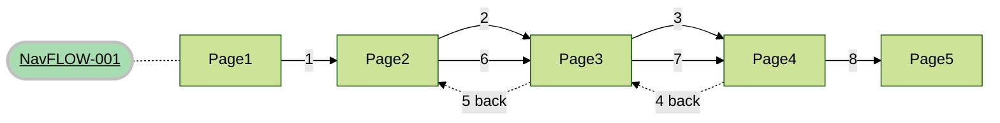

***
***

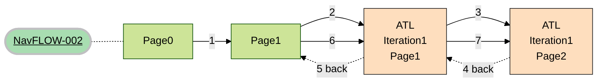
***
***
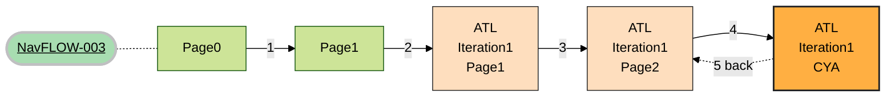
***
***

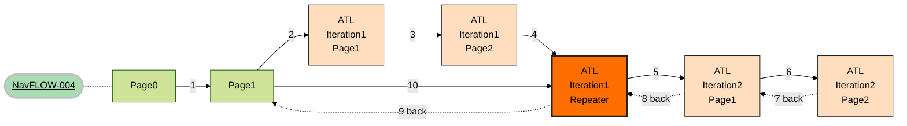
***
***
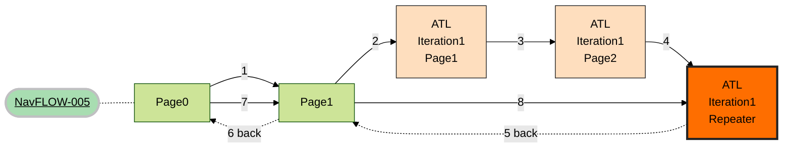
***
***
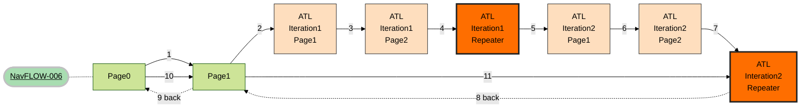
***
***
```mermaid
%%{init: {'theme': 'forest', "flowchart" : { "curve" : "basis" } } }%%
graph LR;
    title([<u>NavFLOW-007</u>])
    title -.- Page0
    Page0 --> |1| Page1
    Page1 --> |2| ATLPage1["ATL<br>Iteration1<br>Page1"]
    ATLPage1 --> |3| ATLPage2["ATL<br>Iteration1<br>Page2"]
    ATLPage2 --> |4| ATLRepeater
    ATLRepeater --> |5| Page2
    Page2 --> |6| Page3
    Page3 --> |7|Page4
    Page4 -.8 back.-> Page3
    Page3 -.9 back.-> Page2
    Page2 -.10 back.-> ATLRepeater["ATL<br>Iteration1<br>Repeater"]

    ATLRepeater --> |11| Page2
    Page2 --> |12| Page3
    Page3 --> |13| Page4

    classDef orange fill:#fedebe,stroke:#222,stroke-width:1px
    classDef orangeCYA fill:#ffaf42,stroke:#222,stroke-width:2px
    classDef orangeRepeater fill:#fe6e00,stroke:#222,stroke-width:3px
    class ATLRepeater orangeRepeater
    class ATLPage2 orange
    class ATLPage1 orange
    classDef redTitle fill:#c21807 ,stroke:#c0c0c2,stroke-width:3px
    classDef greenTitle fill:#a8ddb1 ,stroke:#c0c0c2,stroke-width:3px
    class title greenTitle

```
***
***

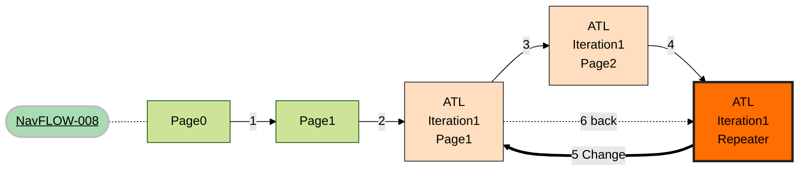
***
***

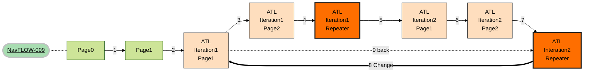
***
***

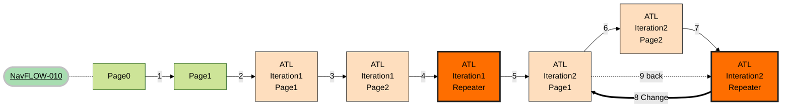

***
***
```mermaid
%%{init: {'theme': 'forest', "flowchart" : { "curve" : "basis" } } }%%
graph LR;
    title([<u>NavFLOW-011</u>])
    title -.- Page0
    Page0 --> |1| Page1
    Page1 --> |2| ATLPage1["ATL<br>Iteration1<br>Page1"]
    ATLPage1 --> |3| ATLPage2["ATL<br>Iteration1<br>Page2"]
    ATLPage2 --> |4| ATLCYA1["ATL<br>Iteration1<br>CYA"]
    ATLCYA1 --> |5| ATLRepeater["ATL<br>Iteration1<br>Repeater"]
    ATLRepeater ===> |6 Change|ATLCYA1
    ATLCYA1 -.7 back.-> ATLRepeater

    classDef orange fill:#fedebe,stroke:#222,stroke-width:1px
    classDef orangeCYA fill:#ffaf42,stroke:#222,stroke-width:2px
    classDef orangeRepeater fill:#fe6e00,stroke:#222,stroke-width:3px
    class ATLRepeater orangeRepeater
    class ATLCYA1 orangeCYA
    class ATLPage2 orange
    class ATLPage1 orange
    classDef greenTitle fill:#a8ddb1 ,stroke:#c0c0c2,stroke-width:3px
    classDef redTitle fill:#c21807 ,stroke:#c0c0c2,stroke-width:3px
    class title greenTitle


```
***
***
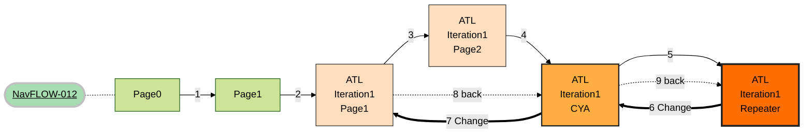

***
***
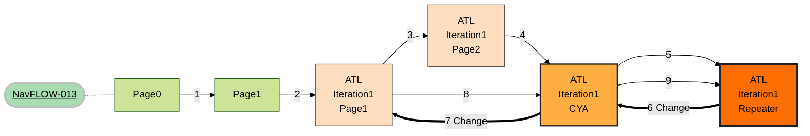

***
***

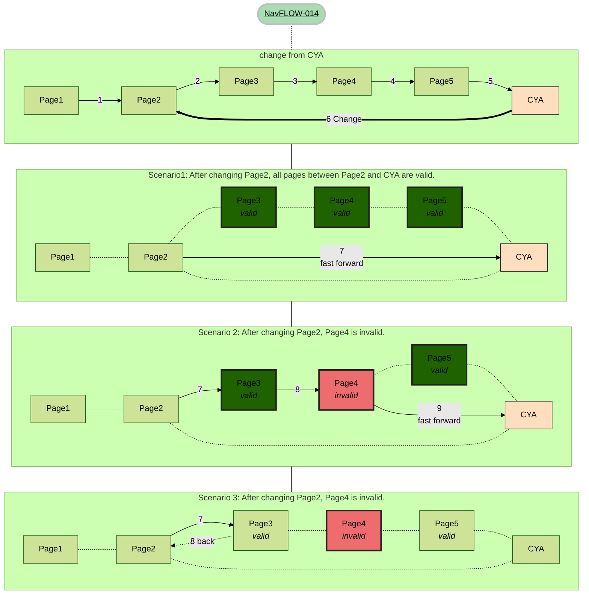
***
***
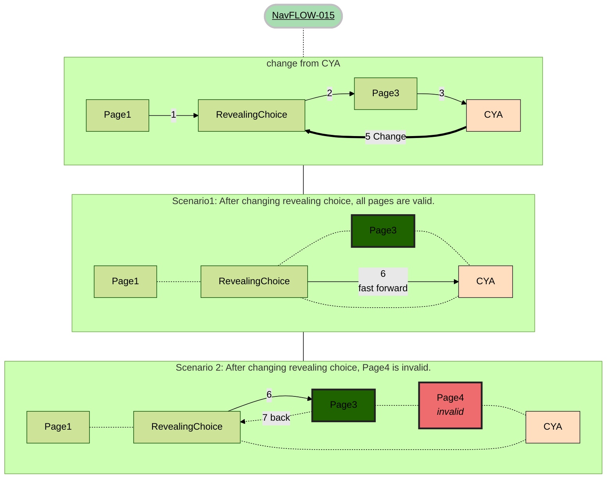
***
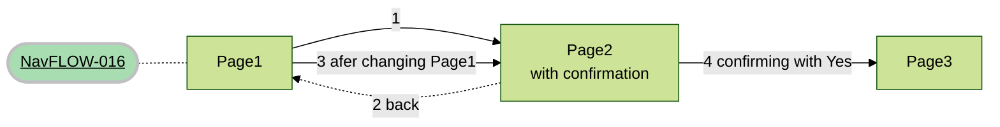

***
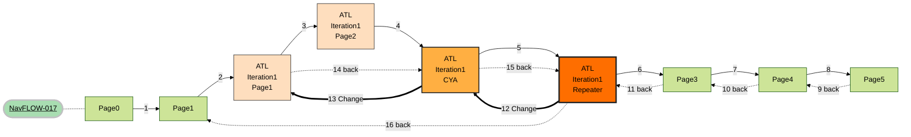
***
***
```mermaid
%%{init: {'theme': 'forest', "flowchart" : { "curve" : "basis" } } }%%
graph LR;
    title([<u>NavFLOW-018</u>])
    title -.- Page0
    Page0 --> |1| Page1
    Page1 --> |2| ATLPage1["ATL<br>Iteration1<br>Page1"]
    ATLPage1 --> |3| ATLPage2["ATL<br>Iteration1<br>Page2"]
    ATLPage2 --> |4| ATLCYA1["ATL<br>Iteration1<br>CYA"]
    ATLCYA1 --> |5| ATLRepeater["ATL<br>Iteration1<br>Repeater"]
    ATLRepeater --> |6| Page3
    Page3 --> |7| Page4
    Page4 --> |8| Page5
    Page5 -.9 back.-> Page4
    Page4 -.10 back.-> Page3
    Page3 -.11 back.-> ATLRepeater

    ATLRepeater ===> |12 Change|ATLCYA1
    ATLCYA1 ===> |13 Change| ATLPage1
    ATLPage1 -.14 back.-> ATLCYA1
    ATLCYA1 -.15 back.-> ATLRepeater
    ATLRepeater --> |16| Page3
    Page3 --> |17| Page4
    Page4 --> |18| Page5

    classDef orange fill:#fedebe,stroke:#222,stroke-width:1px
    classDef orangeCYA fill:#ffaf42,stroke:#222,stroke-width:2px
    classDef orangeRepeater fill:#fe6e00,stroke:#222,stroke-width:3px
    class ATLRepeater orangeRepeater
    class ATLCYA1 orangeCYA
    class ATLPage2 orange
    class ATLPage1 orange
    classDef greenTitle fill:#a8ddb1 ,stroke:#c0c0c2,stroke-width:3px
    class title greenTitle
```
***
***
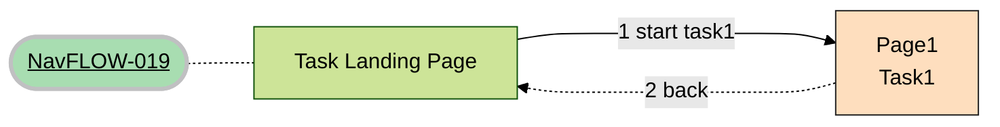
***
***

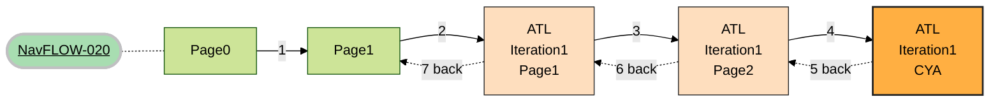
***
***

```mermaid
%%{init: {'theme': 'forest', "flowchart" : { "curve" : "basis" } } }%%
graph LR;
    title([<u>NavFLOW-021</u>])
    title -.- Page1
    Page1 --> |1 'page2'| Page2["Page2<br>valid if<br>page1 = 'page2'"]
    Page2 -.-  Page3["Page3<br>valid if<br>page1 = 'page2'"]
    Page2 -.2 back.-> Page1
    Page1 --> |3 'foo'| Page4
    Page3 -.- Page4

    classDef greenTitle fill:#a8ddb1 ,stroke:#c0c0c2,stroke-width:3px
    class title greenTitle
```
***
***
```mermaid
%%{init: {'theme': 'forest', "flowchart" : { "curve" : "basis" } } }%%
graph LR;
    title([<u>NavFLOW-022</u>])
    title -.- Page0
    Page0 --> |1| Page1
    Page1 --> |2| ATLPage1["ATL<br>Iteration1<br>Page1"]

    ATLPage1 --> |3| ATLPage2["ATL<br>Iteration1<br>Page2"]
    ATLPage2 --> |4| ATLRepeater["ATL<br>Iteration1<br>Repeater"]
    ATLRepeater --> |5| ATLPage12["ATL<br>Iteration2<br>Page1"]

    ATLPage12 --> |6| ATLPage22["ATL<br>Iteration2<br>Page2"]
    ATLPage22 --> |7| ATLRepeater2["ATL<br>Interation2<br>Repeater"]
    ATLRepeater2 ===> |8 Change| ATLPage1
    ATLPage1 --> |9| ATLPage2
    ATLPage2 --> |10| ATLRepeater2


    classDef orange fill:#fedebe,stroke:#222,stroke-width:1px
    classDef orangeCYA fill:#ffaf42,stroke:#222,stroke-width:2px
    classDef orangeRepeater fill:#fe6e00,stroke:#222,stroke-width:3px
    class ATLRepeater orangeRepeater
    class ATLPage2 orange
    class ATLPage1 orange
    class ATLPage12 orange
    class ATLPage22 orange
    class ATLRepeater2 orangeRepeater
    classDef redTitle fill:#c21807 ,stroke:#c0c0c2,stroke-width:3px
    classDef greenTitle fill:#a8ddb1 ,stroke:#c0c0c2,stroke-width:3px
    class title greenTitle

```
***
***

```mermaid
%%{init: {'theme': 'forest', "flowchart" : { "curve" : "basis" } } }%%
graph LR;
    title([<u>NavFLOW-023</u>])
    title -.- Page0
    Page0 --> |1| Page1
    Page1 --> |2| ATLPage1["ATL<br>Iteration1<br>Page1"]

    ATLPage1 --> |3| ATLPage2["ATL<br>Iteration1<br>Page2"]
    ATLPage2 --> |4| ATLRepeater["ATL<br>Iteration1<br>Repeater"]
    ATLRepeater --> |5| ATLPage12["ATL<br>Iteration2<br>Page1"]

    ATLPage12 --> |6| ATLPage22["ATL<br>Iteration2<br>Page2"]
    ATLPage22 --> |7| ATLRepeater2["ATL<br>Interation2<br>Repeater"]
    ATLRepeater2 --> |8| CYA["Form<br>Summary<br>Page"]
    CYA ==> |9 Change| ATLRepeater2
    ATLRepeater2 ===> |10 Change| ATLPage1
    ATLPage1 --> |11| ATLPage2
    ATLPage2 --> |12| ATLRepeater2

    classDef orange fill:#fedebe,stroke:#222,stroke-width:1px
    classDef orangeCYA fill:#ffaf42,stroke:#222,stroke-width:2px
    classDef orangeRepeater fill:#fe6e00,stroke:#222,stroke-width:3px
    class ATLRepeater orangeRepeater
    class ATLPage2 orange
    class ATLPage1 orange
    class ATLPage12 orange
    class ATLPage22 orange
    class ATLRepeater2 orangeRepeater
    classDef redTitle fill:#c21807 ,stroke:#c0c0c2,stroke-width:3px
    classDef greenTitle fill:#a8ddb1 ,stroke:#c0c0c2,stroke-width:3px
    class title greenTitle

```
```mermaid
%%{init: {'theme': 'forest', "flowchart" : { "curve" : "basis" } } }%%
graph LR;
    title([<u>NavFLOW-024</u>])
    title -.- Page1
    Page1 --> |1| Page2
    Page2 --> |2| Page3
    Page3 -.-  Page4["Page4<br><i>invalid"]
    Page4 -.- Page5
    Page3 --> |3| Page5
    Page5 --> |4| Page6
    Page6 -.5 back.-> Page5
    Page5 -.6 back.-> Page3
    Page3 -.7 back.-> Page2
    Page2 --> |8| Page3
    Page3 --> |9| Page5
    Page5 --> |10| Page6

    classDef invalid fill:#ee6b6e,stroke:#222,stroke-width:3px
    class Page4 invalid
    classDef greenTitle fill:#a8ddb1 ,stroke:#c0c0c2,stroke-width:3px
    class title greenTitle

    classDef orange fill:#fedebe,stroke:#222,stroke-width:1px
    classDef orangeCYA fill:#ffaf42,stroke:#222,stroke-width:2px
    classDef orangeRepeater fill:#fe6e00,stroke:#222,stroke-width:3px
    class ATLRepeater orangeRepeater
    class ATLPage2 orange
    class ATLPage1 orange
    class ATLPage12 orange
    class ATLPage22 orange
    class ATLRepeater2 orangeRepeater
    classDef redTitle fill:#c21807 ,stroke:#c0c0c2,stroke-width:3px
    classDef greenTitle fill:#a8ddb1 ,stroke:#c0c0c2,stroke-width:3px
    class title greenTitle


```
# Notes for developers
Before updating the mermaid diagram in the file please test here:
https://mermaid.live/
